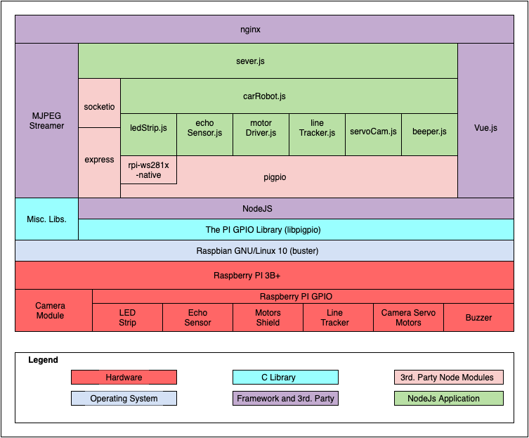

# PI-ROBOT-CAT

## Block Diagram



## MJPEG Streamer

Setup Guide: Raspberry Pi | MJPEG Streamer Install & Setup & FFMpeg Recording <https://github.com/cncjs/cncjs/wiki/Setup-Guide:-Raspberry-Pi-%7C-MJPEG-Streamer-Install-&-Setup-&-FFMpeg-Recording>

## Get a domain name (DuckDNS <https://www.duckdns.org/>)

### Forward ports 80 and 443 to your raspberry pi address

## Get an SSL certificate from LetsEncrypt

The instructions below are from certbot.eff.org <https://certbot.eff.org/lets-encrypt/debianbuster-nginx>

### Install certbot

````bash
    sudo apt-get install certbot python-certbot-nginx
````

## NGINX installation

### If needed remove apache if installed to avoid port conflicts

````bash
    sudo apt-get remove apache2
````

### Install nginx

````bash
    sudo apt-get install nginx
````

### Start nginx

````bash
    sudo systemctl start nginx
````

### Try it

Open a browser and enter:
    <http://raspberry-pi-address>

### Grab certificate for your domain

````bash
    sudo certbot certonly --nginx -w /var/www/example -d example.com -d www.example.com
````

Note: replace example.com by your domain

### Generate certificates for the nginx reverse proxying to the backend server

````bash
    openssl req -x509 -newkey rsa:4096 -keyout key.pem -out cert.pem -days 365 --nodes
````

### Change nginx configuration

Create a soft link from /etc/nginx/sites-availabe to nginx.conf (from the repo)

````bash
    cd /etc/nginx/sites-available
    sudo ln -s /home/pi/git/pi-robot-car/nginx.conf example.com
````

Make the site enabled

````bash
    cd /etc/nginx/sites-enable
    sudo ln -s /etc/nginx/sites-available/example.com example.com
````

### Try it using secure connection

````bash
    https://example.com
````

### Every 3 months the ceritificate needs to be renewed

To obtain a new or tweaked version of this certificate in the future, simply run certbot again with the "certonly" option. To non-interactively renew *all* of your certificates, run "certbot renew"

## Project setup

````bash
    npm install
````

## Start backend server

````bash
    npm start
````

### Compiles and hot-reloads for development

````bash
    npm run serve
````

### Compiles and minifies for production

````bash
    npm run build
    ./setup.sh
````

### Lints and fixes files

````bash
    npm run lint
````

### Customize configuration

See [Configuration Reference](https://cli.vuejs.org/config/).
